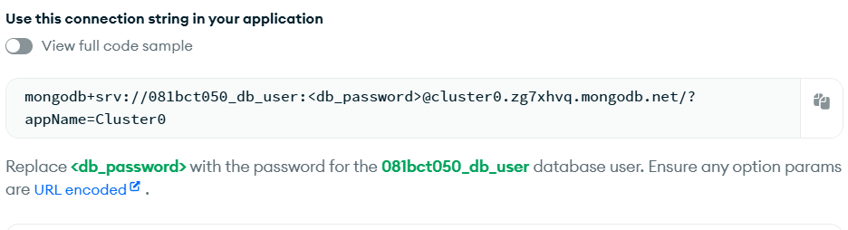

Open mongodb.com and create a database
ORM acts as a link between backend and database
ORM tools-- mongoose

 ----> connection string

## db connection or db query garne code ko agadi await halnu parchaa, ani mathi ko function ko agadi async halna parcha
## await lai async chaincha
## async and await --- they let you wait for async work without blocking the whole program

# Steps of making table/mode

1. mongoose require/import garne
2. schema class of mongoose lai assign garne
3. tyo class ko object create garne ani teslai schema class ko constructor sanga assign garne(teslai model banaune rules vanincha)
4. const Blog = mongoose.model("Blog", blogSchema) yo step ma table/model create garne with rule i.e. blogSchema here
5. table/model i.e. Blog here lai export garne 